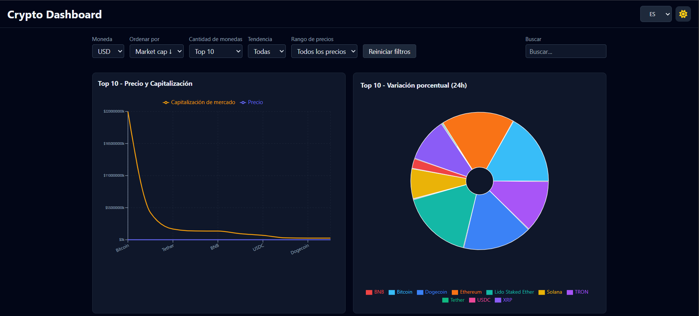
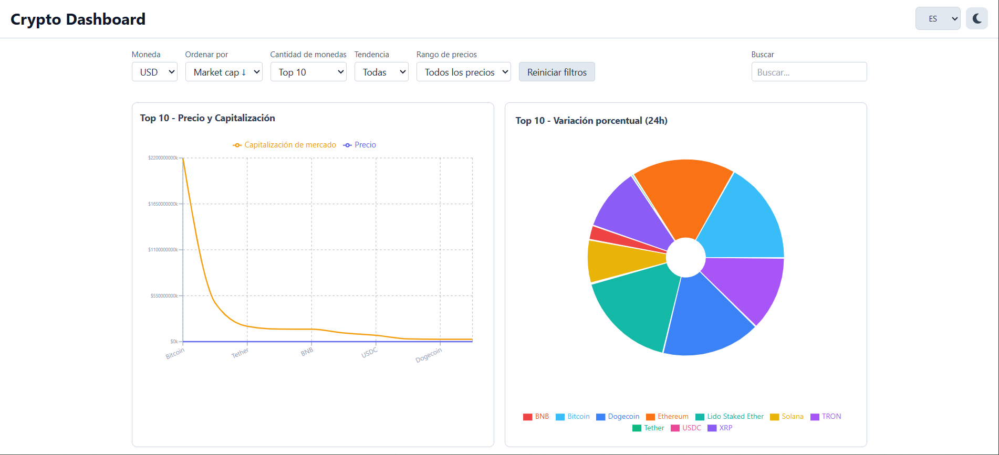
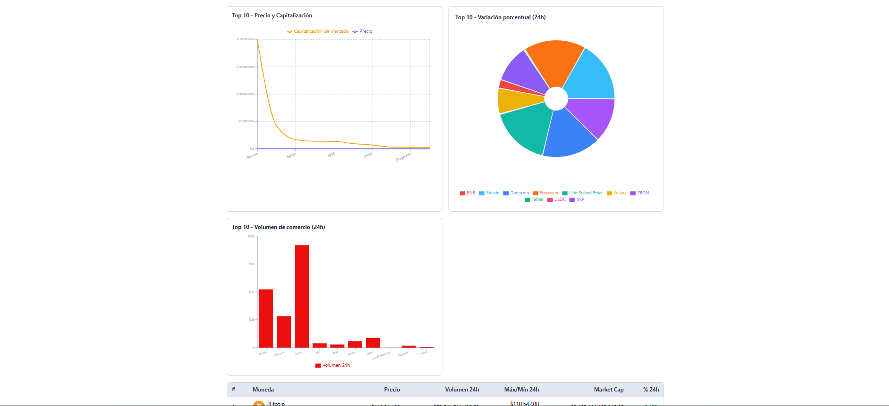
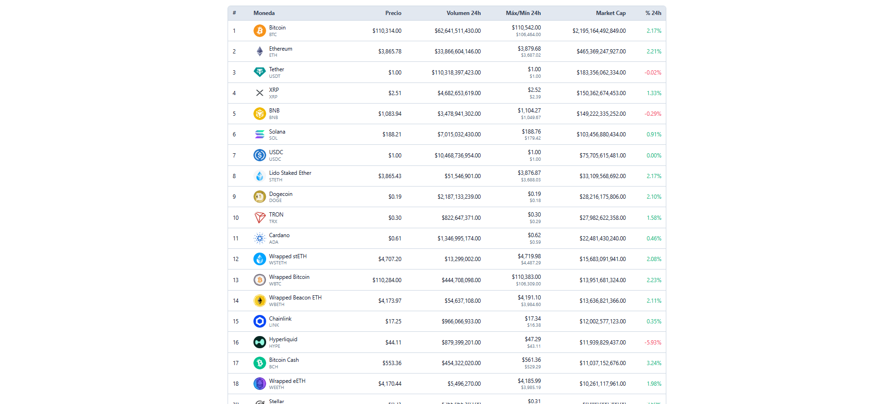
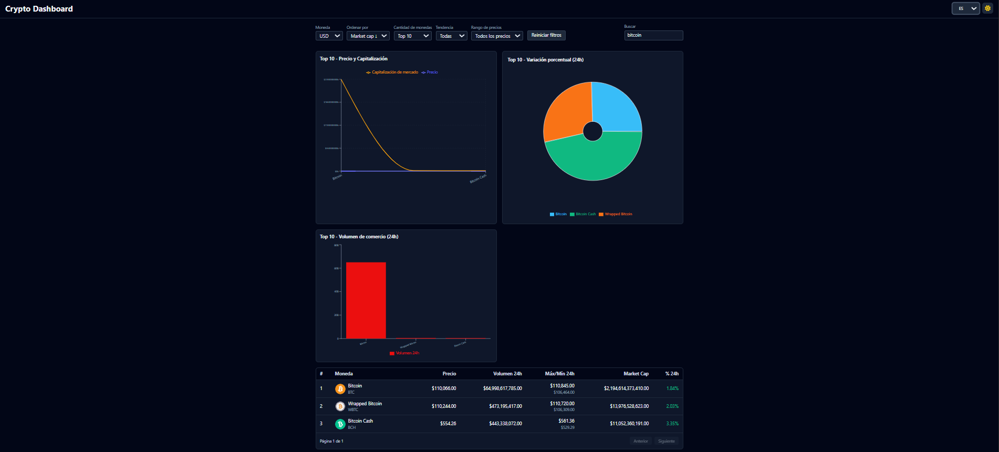
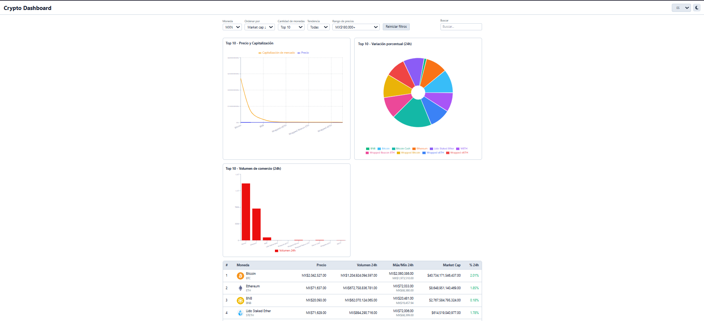
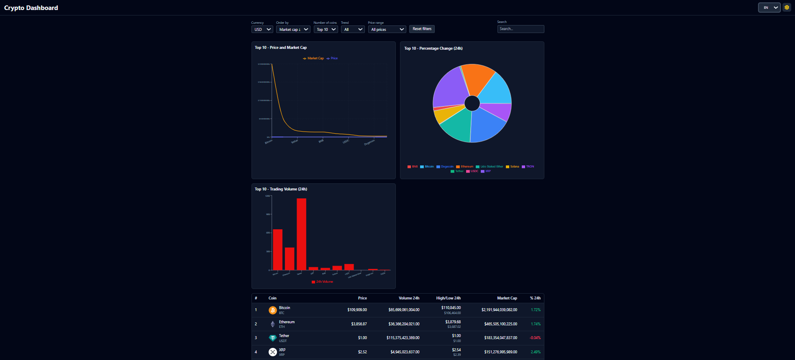

# Crypto Dashboard - Prueba Tecnica Front-End Engineer

**Crypto Dashboard** es un panel interactivo desarrollado con **React + Vite** que consume datos de la API de **CoinGecko**.
Permite visualizar informacion de las principales criptomonedas, aplicar filtros dinámicos, cambiar entre idiomas, alternar tema claro/oscuro y analizar métricas mediante gráficos interactivos.


## Descripción General

El dashboard obtiene datos de la API de **CoinGecko**, los procesa y los representa mediante **gráficos interactivos y tablas accesibles**.  
Se buscó un balance entre rendimiento, accesibilidad, diseño limpio y estructura modular.

### Objetivos principales:
- Mostrar datos actualizados de criptomonedas.  
- Implementar gráficos dinámicos con Recharts.  
- Incluir filtros, ordenamiento y búsqueda en tiempo real.  
- Garantizar accesibilidad (lectores de pantalla, teclado).  
- Mantener un diseño responsivo y moderno.  
- Incluir pruebas unitarias para asegurar la estabilidad del código.


## Tecnologías

**Framework principal** | React 19 + Vite 
**Lenguaje** | JavaScript (ES2023) 
**Estilos** | Tailwind CSS 
**Gráficos** | Recharts 
**Datos** | API pública de CoinGecko 
**Internacionalización** | react-i18next 
**Testing** | Jest + React Testing Library 
**Linting** | ESLint moderno
**Accesibilidad** | Roles ARIA + etiquetas `sr-only`


## Instrucciones de Configuracion y Ejecucion

### Clonar el repositorio
```
git clone https://github.com/JulioVillalobos03/crypto-dashboard.git
```

### Instalar dependencias
```
npm install
```

### Ejecutar el proyecto
```
npm run dev
```

### Ejecutar pruebas unitarias
```
npm run test
```

---

## Funcionalidades principales

- Vizualizacion de datos
  - Consumo de APi de CoinGecko
  - Muestra informacion de las principales criptomonedas, entre ellas el precio, volumen, market cap, cambio porcentual 24h.
  - Actualizacion automatica de los datos al aplicar filtros. 
- Gaficos Implementados
  - LineChart – evolución de precio y market cap.
  - PieChart – evolución de cambio porcentual.
  - BarChart – evolución de volumen de comercio.
- Filtros e Interactividad
  - Moneda: USD, EUR, MXN.
  - Orden: por capitalización o volumen.
  - Top: mostrar las primeras 10, 20 o 30 monedas.
  - Tendencia: todas, positivas o negativas.
  - Rango de precios: dinámico según la moneda.
  - Buscador y botón “Reiniciar filtros”.
- Accesibilidad
  - Roles semánticos ARIA (banner, main, table, region, contentinfo).
  - Descripciones ocultas (sr-only) para gráficos y tablas.
  -  Soporte para lectores de pantalla.
  - Navegacion mediante teclado.
- Diseño responsivo
  - Adaptable a moviles, tabletas y escritorios.
  - Uso de Flexbox y Grid con Tailwind CSS.
  - Diseño modular y limpio.
- Modo Oscuro / claro
  - Tema oscuro y claro.
  - Botón para alternar entre el modo oscuro y claro.
  - Configuración de tema en localStorage.
  - Soporte para lectores de pantalla.
- Internacionalización
  - Soporte para inglés y español.
  - Configuración de idioma en localStorage.
  - Botón para cambiar idioma.
  - Soporte para lectores de pantalla.
  - Traducción automática de mensajes de error.
  - Traducción automática de etiquetas de mensajes de error.

---

## Enfoque Adaptado

El enfoque del proyecto se basa en una arquitectura modular, centrada en la claridad, accesibilidad y rendimiento.
Se priorizó un diseño mobile-first, componentes reutilizables, y una experiencia accesible compatible con lectores de pantalla.
Se implementaron hooks personalizados, internacionalización y pruebas unitarias para asegurar un flujo estable y predecible.

## Suposiciones y Problemas Conocidos
- Suposiciones:
  - Se tiene una conexión a Internet estable y rápida.
  - Los datos se obtienen mediante peticiones HTTP directas.
  - Se usa una clave pública de CoinGecko
  - La API de CoinGecko proporciona datos actualizados.
  - EL dashboard esta optimizado.
  - Los filtros se restablecen al recargar la aplicacion.
- Problemas conocidos:
  - La API puede devolver error 429 (Too Many Requests) si se supera el límite de peticiones.
  - CoinGecko no garantiza datos de sparkline o ath_change_percentage en todas las monedas.
  - CoinGecko no proporciona datos de precio de mercado para todas las monedas.

## Capturas de pantalla

- Vista General

- Uso de Modo Claro

- Vista de Graficas de datos

- Tabla de datos

- Filtro de busqueda

- Uso de filtros

- Cambio de idioma


## 🚀 Despliegue en Producción

🔗 **Demo en Vivo:**  
👉 [Crypto Dashboard](https://crypto-dashboard-f32y2b8qt-julio-villalobos-projects.vercel.app/)


## 🧑‍💻 Autor

**Julio Villalobos**  
Desarrollador Front-End / Fullstack  

📧 **Email:** [julioalbertoocampovillalobos2@gmail.com](mailto:julioalbertoocampovillalobos2@gmail.com)  
🔗 **GitHub:** [@JulioVillalobos03](https://github.com/JulioVillalobos03)  